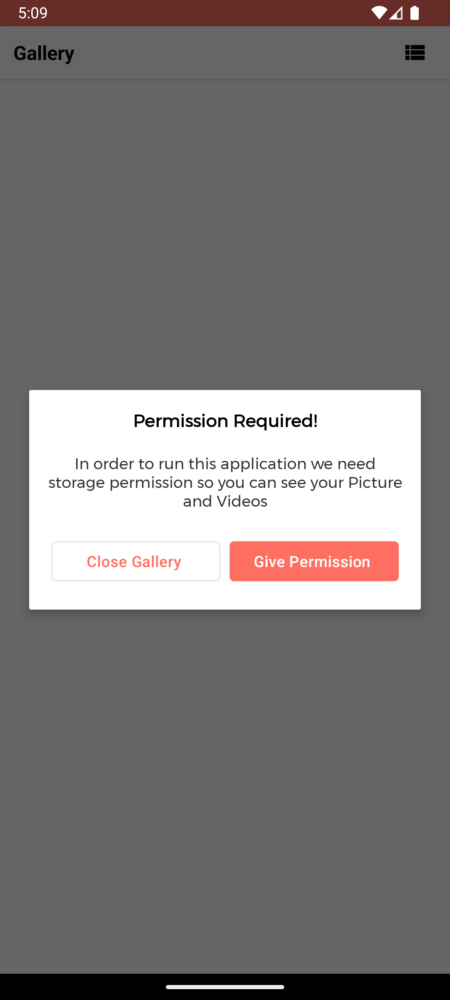
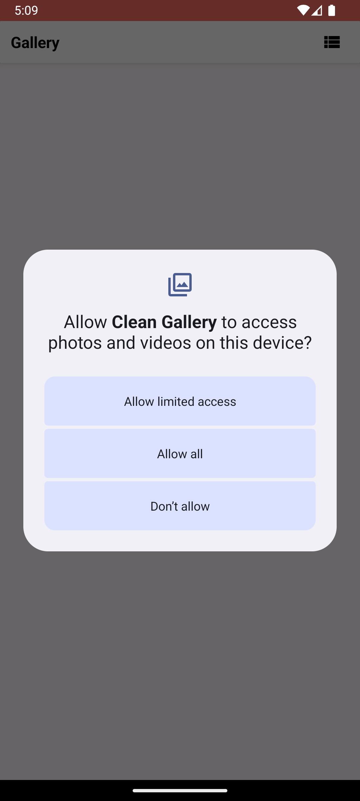
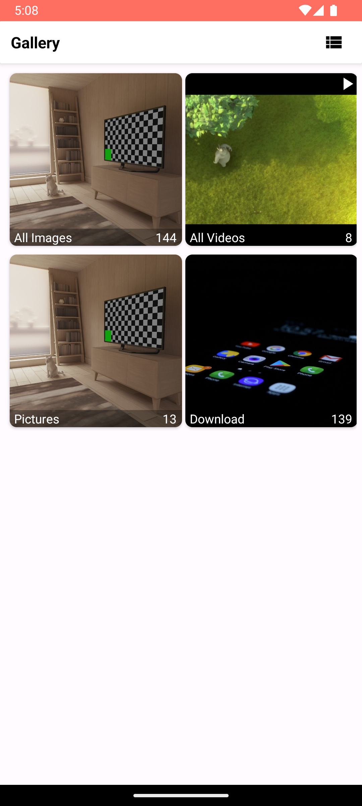
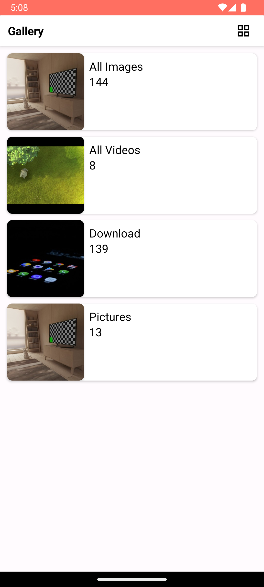
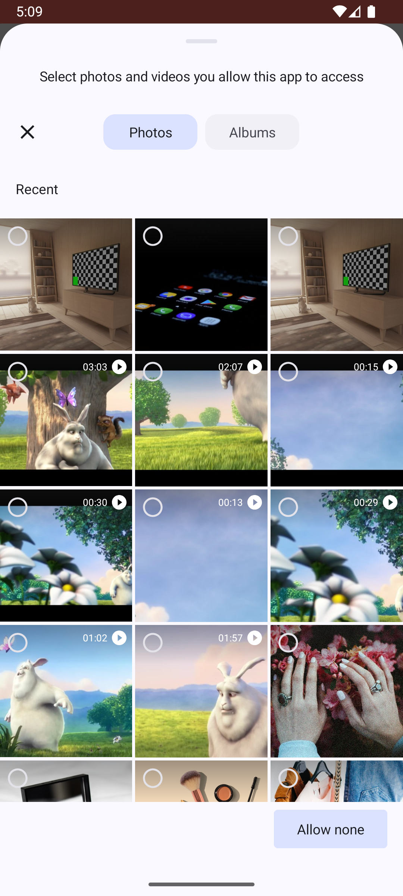
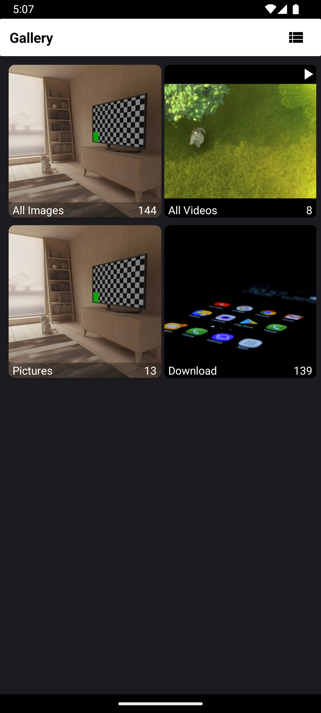
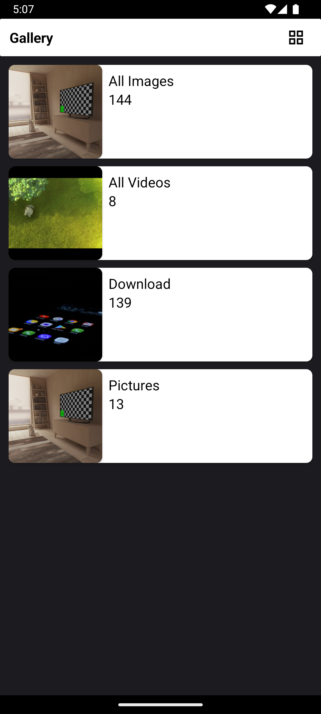
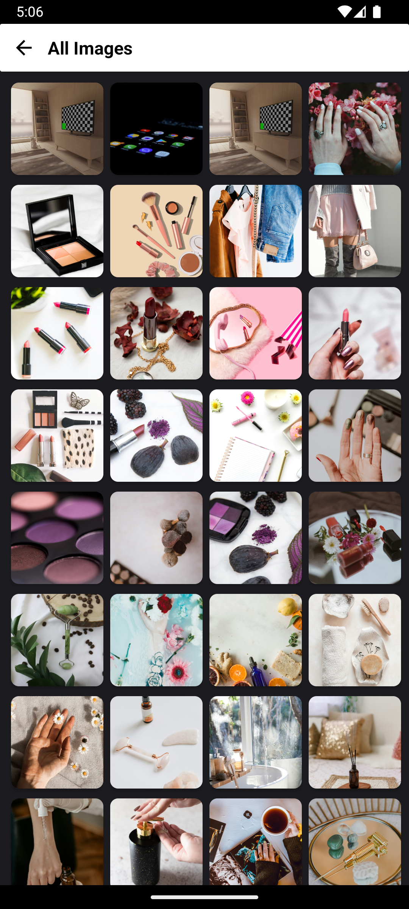
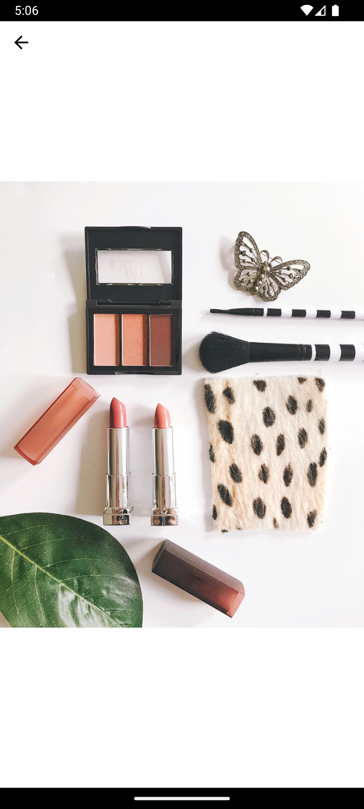

# *Clean Gallery Application*

## *Git Repository Link:*
- [GitHub Repository](https://github.com/khanadrali/Clean-Gallery)
- Clone with Git: git clone https://github.com/khanadrali/Clean-Gallery.git

## *Application Architecture:*
- *Clean Architecture*

## *Device Specification:*
- *Min SDK:* 24
- *Compile SDK:* 34
- *Target SDK:* 34
- *Package Name:* com.avrioc.cleangallery

## *Permissions Required:*
- *android.permission.READ_EXTERNAL_STORAGE* (for API level 32 or lower)
- *android.permission.READ_MEDIA_IMAGES* (for API level 33 or higher)
- *android.permission.READ_MEDIA_VIDEO* (for API level 33 or higher)
- *android.permission.READ_MEDIA_VISUAL_USER_SELECTED* (for API level 34 or higher)

## *Jetpack Components Used:*
- *ViewModel*
- *LiveData*
- *Coroutine*
- *Coroutine Flow*
- *Dependency Injection (Hilt)*
- *Navigation Component*
- *Pagination*

## *Additional Dependencies Used:*
- *Glide* for Image Loading
- *Lottie* for Lottie animations
- *Material Dialog* for dialogs

## *Classes and UI*

### *Activities:*
- *MainActivity.kt* (Single Activity)

### *Fragments:*
- *AlbumListFragment* with ViewModel: Displays albums without pagination (up to 20 albums).
- *AlbumDetailFragment* with ViewModel: Shows images with pagination in a RecyclerView, using MediaDiffCallback to assist with pagination.
- *SinglePhotoFragment* with ViewModel: Displays a single photo.

### *Adapters:*
- *AlbumAdapter*
- *PhotoAdapter*

### *PermissionManager Class:*
- Manages permission requests for all versions of Android (API Level 24 to API Level 34).

### *PermissionDialogHelper:*
- Handles the display of permission dialogs.

### *BinderAdapter:*
- Contains custom binding functions.

### *MediaDiffCallback:*
- Utilized with the adapter to manage item additions in RecyclerView.

## *Screenshots for Light Theme*

1. 
2. 
3. 
4. 
5. 
6. 
7. 

## *Screenshots for Dark Theme*

1. 
2. 
3. 
4. 